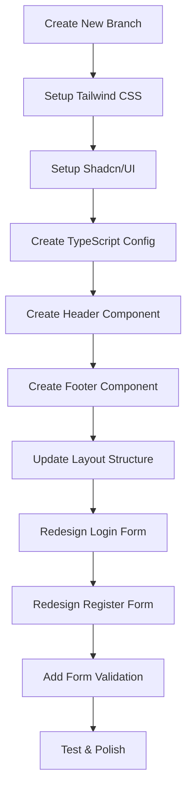
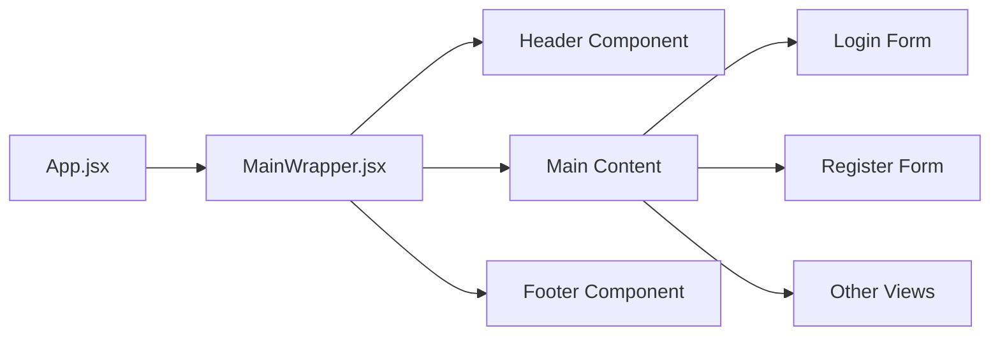

# Django React Auth - Tailwind CSS & Shadcn/UI Implementation Plan

## Project Overview
Transform the existing Django-React authentication system by adding modern UI components using Tailwind CSS v4 and Shadcn/UI with a blue theme.

## Current State Analysis
- Django backend with authentication API
- React frontend with Vite bundler
- Basic authentication system with login/register/logout
- Zustand for state management
- React Router for navigation
- Basic HTML forms without styling

## Implementation Phases



### Phase 1: Environment Setup

1. **Create new git branch** for this feature
2. **Install Tailwind CSS v4** using Vite plugin
3. **Configure TypeScript** paths (needed for Shadcn)
4. **Setup Shadcn/UI** with blue theme
5. **Install required dependencies**:
   - `@tailwindcss/vite`
   - `@types/node` 
   - Shadcn components (Button, Input, Card, Form, Label)

### Phase 2: UI Architecture



#### Header Component (`frontend/src/components/Header.jsx`)
- Project title "Django React Auth" on the left
- Login/Register/Logout buttons on the right
- Responsive design with mobile menu
- Dynamic button display based on auth state

#### Footer Component (`frontend/src/components/Footer.jsx`)
- Simple footer with copyright info
- Consistent styling with header

### Phase 3: Form Redesign

#### Enhanced Login Form (`frontend/src/views/login.jsx`)
- Modern card-based design using Shadcn Card component
- Input components with proper validation states
- Loading states during authentication
- Error handling with toast notifications
- Responsive design

#### Enhanced Register Form (`frontend/src/views/register.jsx`)
- Consistent styling with login form
- Real-time password confirmation validation
- Form validation with visual feedback
- Better error messages

### Phase 4: Component Structure

```
frontend/src/
├── components/
│   ├── ui/              # Shadcn components
│   ├── Header.jsx
│   ├── Footer.jsx
│   └── forms/
│       ├── LoginForm.jsx
│       └── RegisterForm.jsx
├── views/
│   ├── login.jsx        # Updated
│   └── register.jsx     # Updated
└── lib/
    └── utils.js         # Utility functions
```

### Phase 5: Configuration Files

#### Update `vite.config.js`:
- Add Tailwind plugin
- Configure path aliases
- Add TypeScript support

#### Create TypeScript configs:
- `tsconfig.json` and `tsconfig.app.json`
- Path resolution for `@/*` imports
- Required for Shadcn components

#### Update `frontend/src/index.css`:
- Import Tailwind CSS v4
- Custom CSS variables for theme

### Phase 6: Enhanced Features

#### Form Validation:
- Client-side validation with visual feedback
- Password strength indicator
- Real-time validation messages

#### Loading States:
- Button loading states during API calls
- Skeleton loaders where appropriate

#### Error Handling:
- Replace `alert()` with elegant toast notifications
- Form field error states

#### Responsive Design:
- Mobile-first approach
- Responsive navigation
- Touch-friendly form elements

## Key Technologies & Tools

- **Tailwind CSS v4**: Latest version with new features
- **Shadcn/UI**: Pre-built, customizable React components
- **Blue Theme**: Modern, vibrant color scheme
- **TypeScript paths**: For clean imports (`@/components/...`)
- **Form validation**: Client-side validation with visual feedback

## Expected Benefits

1. **Modern UI/UX**: Professional, consistent design
2. **Better User Experience**: Improved forms with validation
3. **Maintainable Code**: Component-based architecture
4. **Responsive Design**: Works on all devices
5. **Developer Experience**: Better imports and tooling

## Implementation Steps Summary

1. Create new git branch
2. Install and configure Tailwind CSS v4
3. Setup Shadcn/UI with blue theme
4. Create TypeScript configuration files
5. Build Header and Footer components
6. Update MainWrapper layout to include Header/Footer
7. Redesign Login form with Shadcn components
8. Redesign Register form with consistent styling
9. Add form validation and error handling
10. Test responsive design across devices
11. Polish and optimize

## Success Criteria

- [ ] All forms are styled with Shadcn/UI components
- [ ] Header displays project title and auth buttons
- [ ] Footer is present on all pages
- [ ] Forms have proper validation and error states
- [ ] Design is fully responsive
- [ ] No existing functionality is broken
- [ ] Code follows consistent patterns and best practices

---

**Project**: Django React Auth  
**Theme**: Blue (modern, vibrant)  
**Target**: Modern, professional authentication system  
**Timeline**: Implementation ready for code mode execution